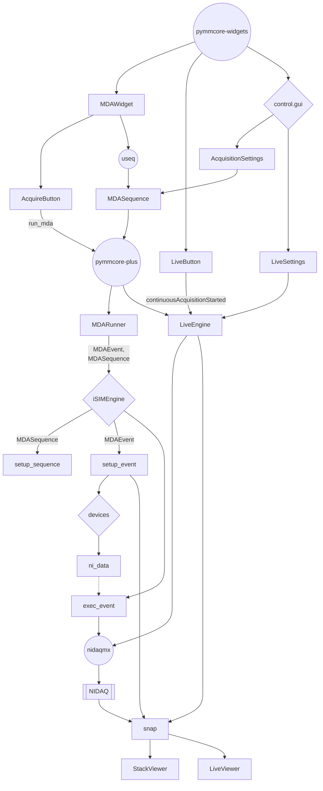

```mermaid
flowchart TD;
    useq((useq))
    pymmcore-plus((pymmcore-plus))
    pymmcore-widgets((pymmcore-widgets))
    iSIMEngine{iSIMEngine}
    control.gui{control.gui}
    devices{devices}
    NIDAQ[[NIDAQ]]
    nidaqmx((nidaqmx))

    %% Acquisisitons
    useq --> MDASequence
    pymmcore-widgets --> MDAWidget
    control.gui --> AcquisitionSettings
    AcquisitionSettings --> MDASequence
    MDAWidget --> AcquireButton
    MDAWidget --> useq
    AcquireButton -- run_mda --> pymmcore-plus
    MDASequence --> pymmcore-plus
    pymmcore-plus --> MDARunner
    MDARunner -- MDAEvent, \n MDASequence --> iSIMEngine
    iSIMEngine -- MDASequence --> setup_sequence
    iSIMEngine -- MDAEvent --> setup_event
    iSIMEngine --> exec_event
    setup_event --> devices
    devices --> ni_data
    setup_event --> snap
    ni_data -.-> exec_event
    exec_event --> nidaqmx
    nidaqmx --> NIDAQ
    snap --> StackViewer

    %% Live Mode
    pymmcore-widgets --> LiveButton
    pymmcore-plus --> LiveEngine
    LiveButton -- continuousAcquisitionStarted --> LiveEngine
    LiveEngine --> nidaqmx
    LiveEngine --> snap
    NIDAQ --> snap
    snap --> LiveViewer

    control.gui --> LiveSettings
    pymmcore-widgets --> control.gui
    LiveSettings --> LiveEngine

```